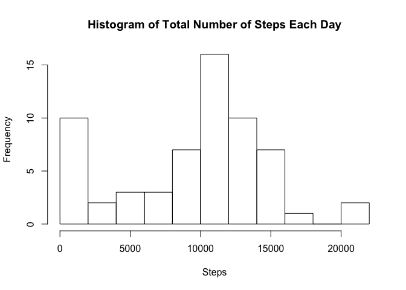
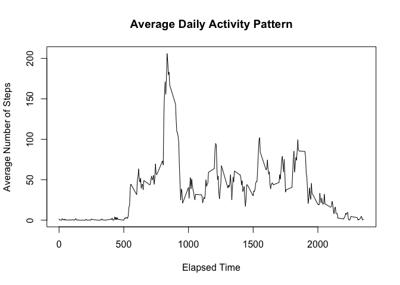
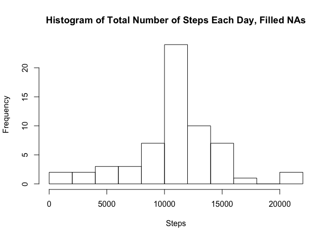
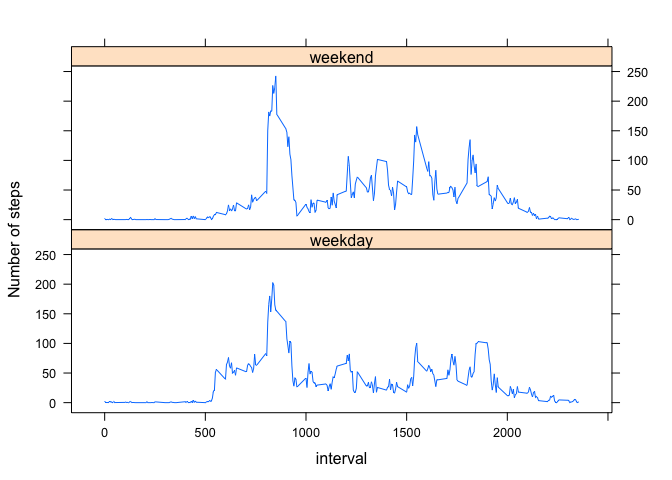

# Reproducible Research: Peer Assessment 1


## Loading and preprocessing the data

```r
df <- read.csv('activity.csv', header=TRUE)
```

## What is mean total number of steps taken per day?

```r
total <- tapply(df$steps, df$date, sum, na.rm=TRUE)
hist(total, breaks=10, main="Histogram of Total Number of Steps Each Day", xlab="Steps")
```

<!-- -->

```r
mea <- mean(total)
med <- median(total)
```
The mean is 9354.2295082 and the median is 10395.

## What is the average daily activity pattern?

```r
library(ggplot2)
interval <- aggregate(df$steps, by=list(interval=df$interval), FUN=mean, na.rm=T)

plot(interval[,1],interval[,2],type='l',
     main='Average Daily Activity Pattern',
     xlab='Elapsed Time',
     ylab='Average Number of Steps'
     )
```

<!-- -->

```r
summary(interval)
```

```
##     interval            x          
##  Min.   :   0.0   Min.   :  0.000  
##  1st Qu.: 588.8   1st Qu.:  2.486  
##  Median :1177.5   Median : 34.113  
##  Mean   :1177.5   Mean   : 37.383  
##  3rd Qu.:1766.2   3rd Qu.: 52.835  
##  Max.   :2355.0   Max.   :206.170
```
A summary of the data shows us that the 5 minute interval with the maximum average number of steps in 2355, and the value of the average is 10927 steps.

## Imputing missing values

```r
colSums(is.na(df))
```

```
##    steps     date interval 
##     2304        0        0
```
The number of NA values in the steps column is displayed above. The following piece of code replaces NA values with the mean from that interval.

```r
impute.mean <- function(x) replace(x, is.na(x), mean(x, na.rm = TRUE))
library(dplyr)
```

```
## 
## Attaching package: 'dplyr'
```

```
## The following objects are masked from 'package:stats':
## 
##     filter, lag
```

```
## The following objects are masked from 'package:base':
## 
##     intersect, setdiff, setequal, union
```

```r
df<-df %>%
      group_by(interval) %>%
      mutate(
        steps = impute.mean(steps)  
      )
```
Below is a histogram of the filled-NA dataframe.

```r
total <- tapply(df$steps, df$date, sum)
hist(total, breaks=10, main="Histogram of Total Number of Steps Each Day, Filled NAs", xlab="Steps")
```

<!-- -->

```r
mea <- mean(total)
med <- median(total)
```
The mean is 1.0766189\times 10^{4} and the median is 1.0766189\times 10^{4}.

## Are there differences in activity patterns between weekdays and weekends?

```r
library(lubridate)
```

```
## 
## Attaching package: 'lubridate'
```

```
## The following object is masked from 'package:base':
## 
##     date
```

```r
library(lattice)
weekend <- df[wday(as.Date(df$date)) %in% 5:7,]
weekday <- df[wday(as.Date(df$date)) %in% 1:5,]

weekend <- aggregate(weekend$steps, by=list(interval=weekend$interval), FUN=mean)
weekday <- aggregate(weekday$steps, by=list(interval=weekday$interval), FUN=mean)
weekend$day <- rep('weekend', length(weekend))
weekday$day <- rep('weekday', length(weekday))

newdf <- rbind(weekday, weekend)
  
with (newdf, 
      xyplot(x ~ interval|day, type="l", 
             ylab="Number of steps",layout=c(1,2)))
```

<!-- -->

